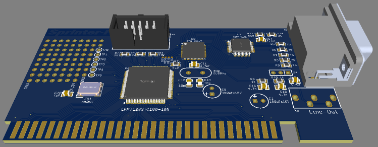

# Sprinter-FT

Проект ISA-8 видеокарты на базе чипа FT812 от FTDI для персонального любительского компьютера Sprinter.

Экспериментальная схема/плата.

[Принципиальная схема](Export/Schematic_Sprinter-FT_v1.0.0.pdf)

[Монтажная схема](Export/PCB_Sprinter-FT_v1.0.0.pdf)

[Файлы для производства](Export/Gerbers/Sprinter-FT_v1.0.0.zip)

[Спринтер в Телеграм](https://t.me/zx_sprinter)

[Спринтер в Web](https://www.sprinter.ru/)

## Изменения
* _v1.0.0_ Первая, экспериментальная версия схемы и  печатной платы.
* _v1.0.1_ Больше контрольных точек для отладки.
